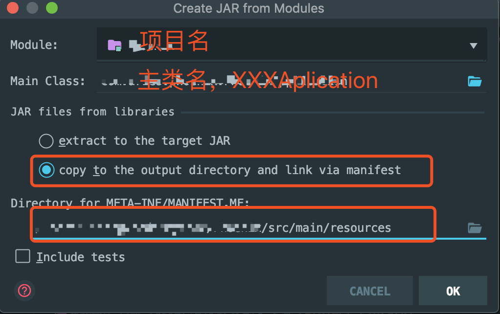

# 部署thrift服务

一、将本地项目deploy到github远程服务器

配置settings.xml



在pom.xml中增加以下内容

```markup
<properties>
    <github.global.server>github</github.global.server> 
    # maven settings.xml中配置了github的账号密码
</properties>
```

```markup
<repositories>
    <repository>
        <id>maven-repo-master</id>
        <url>https://raw.github.com/github用户名/远程仓库名/master/</url>
        <snapshots>
            <enabled>true</enabled>
            <updatePolicy>always</updatePolicy>
        </snapshots>
    </repository>
</repositories>
```

```markup
<build> 
  <finalName>Hera</finalName>
  <!-- 改成自己的项目名 -->  
  <plugins> 
    <plugin> 
      <artifactId>maven-deploy-plugin</artifactId>  
      <configuration> 
        <!--<packaging>jar</packaging>-->  
        <altDeploymentRepository> 
          <!-- deploy后在对应的本地target目录下 会有mvn-repo子文件夹 --> internal.repo::default::file://${project.build.directory}/mvn-repo
        </altDeploymentRepository> 
      </configuration> 
    </plugin>  
    <plugin> 
      <groupId>com.github.github</groupId>  
      <artifactId>site-maven-plugin</artifactId>  
      <version>0.12</version>  
      <configuration> 
        <message>Maven artifacts for ${project.version}</message>  
        <noJekyll>true</noJekyll>  
        <outputDirectory>${project.build.directory}/mvn-repo</outputDirectory>  
        <branch>refs/heads/master</branch>  
        <merge>true</merge>  # 这里一定要写merge为true，不然会将远程清空重新部署的
        <includes> 
          <include>**/*</include> 
        </includes>  
        <repositoryName>远程仓库名</repositoryName>  
        <!-- 对应github上创建的仓库名称 name -->  
        <repositoryOwner>github账号</repositoryOwner>  
        <!-- 你的用户名 , github 仓库所有者 --> 
      </configuration>  
      <executions> 
        <execution> 
          <goals> 
            <goal>site</goal> 
          </goals>  
          <phase>deploy</phase> 
        </execution> 
      </executions> 
    </plugin>  
    <plugin> 
      <artifactId>maven-source-plugin</artifactId>  
      <executions> 
        <execution> 
          <id>attach-sources</id>  
          <phase>deploy</phase> 
        </execution> 
      </executions> 
    </plugin>  
    <plugin> 
      <artifactId>maven-javadoc-plugin</artifactId>  
      <executions> 
        <execution> 
          <id>attach-javadocs</id>  
          <phase>deploy</phase> 
        </execution> 
      </executions> 
    </plugin> 
  </plugins> 
</build>

```

在本地项目运行mvn clean deploy，此时查看github远程仓库是否存在刚刚部署的jar。

二、将本地项目部署到远程服务器

1.首先将本地项目打成jar，我的项目是springboot项目,所以在本地进行下面的操作




Build--&gt;Build Artifacts --&gt;项目名.jar--&gt;build

项目生成jar的路径：在classes/artifacts/项目名\_jar/项目名.jar


2.将本地jar上传到远程服务器

```text
// 在本机执行scp命令
scp 本地jar目录 远程用户名@机器ip:/你的目录
```

3.在远程服务器上运行jar

```text
// 在服务器上执行下面
nohup java -jar -server 项目名.jar >/dev/null 2>&1 &

参数含义：
nohup:表示当前执行命令页面关闭后，java进程不会被关闭
-server：表示当前运行进程对应jvm中server模式
&:表示当前进程在后台运行，不展示在当前页面
>/dev/null：linux重定向，将标准输出重定向到/dev/null。
            当在后台执行进程时，找不到打印日志的目录，因此会报错。
            所以指定输出的日志打印到/dev/null
2>&1：linux重定向，2表示标准错误，1表示标准输出，将标准错误输出到标准输出中
```

三、调用方调用thrift接口

引用对应服务的jar包，调用服务，观察是否调用正常。


