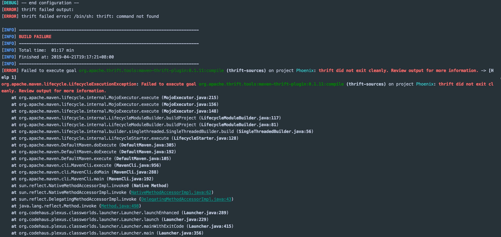
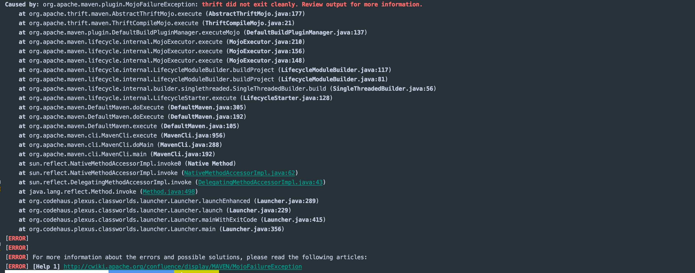

# Thrift插件生成Java代码

1.首先在pom.xml中添加依赖

```text
<dependency>
    <groupId>org.apache.thrift</groupId>
    <artifactId>libthrift</artifactId>
</dependency>
```

2.在plugin中添加插件

```text
<build>
        <plugins>
               <plugin>
                <groupId>org.apache.thrift.tools</groupId>
                <artifactId>maven-thrift-plugin</artifactId>
                <version>0.1.11</version>
                <configuration>
                    <!--<thriftExecutable>/usr/local/bin/thrift-idl</thriftExecutable>-->
                    <thriftSourceRoot>${basedir}/src/main/resources/thrift-idl</thriftSourceRoot>
                    <outputDirectory>${basedir}/target</outputDirectory>
                    <generator>java</generator>
                </configuration>
                <executions>
                    <execution>
                        <id>thrift-sources</id>
                        <phase>generate-sources</phase>
                        <goals>
                            <goal>compile</goal>
                        </goals>
                    </execution>
                    <execution>
                        <id>thrift-idl-test-sources</id>
                        <phase>generate-test-sources</phase>
                        <goals>
                            <goal>testCompile</goal>
                        </goals>
                    </execution>
                </executions>
            </plugin>
        </plugins>
 </build>
```

3.在本地安装thrift

```text
brew install thrift
```

此时可以运行mvn clean install ，会在指定目录生成java代码

4.如果本地没有安装thrift，直接运行mvn clean install， 就会报下面的异常





˙找了好一会才发现原因是本地没有安装thrift，心累，忘记了什么时候给uninstall了，记录一下，下次不要在犯同样的错误了


